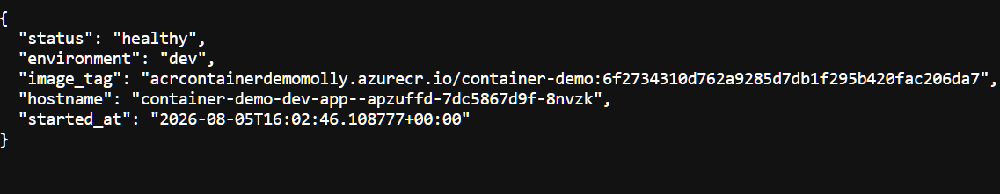
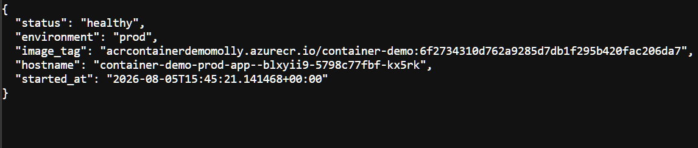
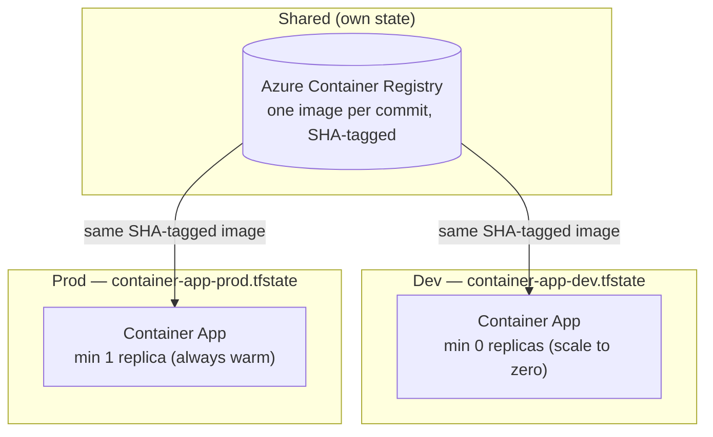
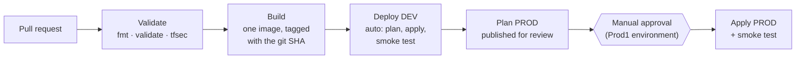

# Containerized App on Azure — Multi-Environment IaC

A containerized Python service on Azure Container Apps, promoted through dev and prod environments by a gated pipeline — one image built per commit, deployed to dev automatically, promoted to prod on approval, and smoke-tested by the pipeline itself at every step. Built entirely through code.

This is a deliberate companion to [azure-webapp-iac](https://github.com/MollyMadel3ine/azure-webapp-iac): where that project demonstrated network security, private endpoints, and gated IaC delivery, this one covers containers, multi-environment Terraform structure, image-based CI/CD, and (Phase 4) identity-based access.

**Status: Phases 1–3 complete — Phase 4 (zero secrets / managed identity) next.**

**Live demo:** both environments run permanently. Same commit, two personalities:




## Architecture



One Terraform configuration defines an environment; **which** environment is decided at plan time by two inputs — the state key (`-backend-config`) and the environment definition (`-var-file`). Dev and prod live in fully separate state files: a botched dev apply cannot touch prod, because prod isn't in the state being written. The registry both environments pull from lives in a third, rarely-changing state of its own (`shared/`).

## How changes ship



- **One image per commit**, tagged with the full git SHA — never `latest`. The image that passes dev's smoke test is byte-for-byte what prod receives: build once, promote the artifact.
- **Dev deploys without approval** — that's what dev is for. The human gate sits *between* environments, not in front of everything.
- **The pipeline verifies its own deployments**: after each apply, it polls the app's `/health` (with retries budgeted for scale-from-zero cold starts) and fails the run unless the response is healthy, reports the **deployed SHA**, and reports the **correct environment name**. Wrong code or wrong target = red run.
- Prod applies **the exact plan file that was reviewed** at the gate, not a fresh plan.

Pull requests run Validate + Build only; no deployment can originate from a branch.

## Repository structure

```
├── app/
│   ├── main.py              # FastAPI: / and /health (reports env, image SHA, replica hostname)
│   └── requirements.txt
├── Dockerfile               # Multi-stage, non-root, ~150MB
├── .dockerignore
├── azure-pipelines.yml      # The promotion flow above
├── main.tf                  # ONE environment definition (which one = init + tfvars)
├── variables.tf             # environment_name validated to dev|prod, no default
├── outputs.tf               # app_url (per environment)
├── dev.tfvars               # Environment definitions — committed on purpose (see below)
├── prod.tfvars
├── shared/
│   └── main.tf              # The ACR, in its own state; applied manually, changes rarely
├── docs/
│   └── project-plan.md
└── images/
```

## Design decisions

**Environments are data, not code.** The differences between dev and prod — replica counts, CPU, memory, the name the app reports — live in `dev.tfvars` and `prod.tfvars`, not in duplicated configurations. Adding a staging environment would be a new tfvars file and a new state key, zero new Terraform.

**Committed tfvars, deliberately.** The usual `*.tfvars` gitignore rule exists to keep secrets out of repos. These tfvars hold replica counts and CPU sizes — environment definitions the pipeline requires from every checkout — so they're carved out with gitignore exceptions (`!dev.tfvars`). Same extension, opposite handling, decided by content. (Learned the direct way: the first promotion run failed because the ignore rule had silently kept them out of the repo.)

**Isolated state per environment, shared registry in a third.** Three state files: dev, prod, and shared. Environment isolation is blast-radius isolation. The registry is shared because the promotion doctrine demands it — both environments must pull the *same* artifact — and it lives in its own rarely-touched config applied manually, bootstrap-style, since the pipeline's job is promoting apps, not managing the registry they come from.

**SHA tags, never latest.** Every image is tagged with the commit that produced it, and the running app *reports its tag* at `/health` — ask production "which commit are you?" and it answers. Immutable tags also make the smoke test's strongest check possible: the pipeline greps the deployed SHA out of the live response.

**The gate sits between environments.** Project #1 gated the only environment; here, dev intentionally deploys ungated (fast feedback is dev's purpose) and the approval guards *promotion*. The reviewer approves a specific published plan for prod, having already seen the same image pass dev's smoke test.

**Smoke tests with cold-start literacy.** Dev scales to zero, so its smoke test retries (10 × 15s) rather than declaring failure at the first cold-start timeout. Scripts fail fast (`set -e`) so a failed plan reports as a plan failure, not a confusing downstream one.

**Flat configuration, no modules — unlike project #1.** Three resources per environment don't earn module ceremony; the parameterization that matters here is per-environment, and tfvars carry it. Different project, different structure, both reasoned.

**ACR admin credentials are a known stepping stone.** Registry auth currently uses admin username/password (held as a Container Apps secret, referenced by name). Phase 4 replaces this with managed identity and disables admin access — tracked, not forgotten.

**Always-warm prod, scale-to-zero dev.** Prod runs min 1 replica (~$12/month) so the standing demo answers instantly; dev cold-starts for free. A cost-conscious real deployment might invert this reasoning — the trade-off is documented, not hidden.

## Local development

The partial backend means every local session declares its environment at init, and its definition at plan:

```bash
# Day-to-day local work targets dev:
terraform init -reconfigure -backend-config="key=container-app-dev.tfstate"
terraform plan -var-file=dev.tfvars

# Prod is pipeline territory; local prod sessions are the exception, not the routine.
```

Switch state key and tfvars **together, always** — a mismatched pair (dev state, prod tfvars) plans prod-named resources into dev's state.

The local container loop needs no Azure at all:

```bash
docker build -t container-demo:local .
docker run --rm -p 8000:8000 container-demo:local
curl http://localhost:8000/health
```

## Getting started (from zero)

Prerequisites: Terraform ≥ 1.5, Azure CLI, Docker Desktop, an Azure subscription with a state storage account (see project #1's bootstrap), and `Microsoft.App` registered (`az provider register --namespace Microsoft.App`).

```bash
# 1. Stand up the shared registry (once)
cd shared && terraform init && terraform apply && cd ..

# 2. Pipeline prerequisites (Azure DevOps): variable group `terraform-credentials`
#    with the SP's ARM_* values; grant the SP AcrPush on the registry;
#    a `Prod1` environment with an approval check; pipeline → this repo's YAML.

# 3. Merge anything to main — the pipeline builds, deploys dev, waits at the
#    gate, and creates prod on approval. Both environments born from CI/CD.
```

## Cost

Prod's always-warm replica is ~$12/month and ACR Basic ~$5; dev scales to zero and the rest is pennies. Total ~$17/month as a permanently-live demo — or set prod's `min_replicas = 0` in prod.tfvars and idle at ~$5.

## Roadmap

- [x] **Phase 1 — Containerize + core infrastructure**: multi-stage Dockerfile (non-root, ~150MB), ACR, Container Apps environment + app via Terraform, remote state
- [x] **Phase 2 — CI/CD**: SHA-tagged image build, plan-as-artifact, gated apply, and a smoke test where the pipeline verifies its own deployment
- [x] **Phase 3 — Multi-environment promotion**: dev and prod from one configuration via tfvars and isolated state; merge → dev (auto) → smoke test → gate → prod
- [ ] **Phase 4 — Zero secrets**: system-assigned managed identity with least-privilege RBAC for ACR pulls, storage, and Key Vault; no passwords anywhere; explicit contrast with project #1's generated-secrets pattern
- [ ] **Phase 5 (optional) — Observability**: Log Analytics, diagnostics, and an alert verified by fire drill, per the pattern established in project #1

Each phase lands as its own pull request. Full plan: [docs/project-plan.md](docs/project-plan.md)
