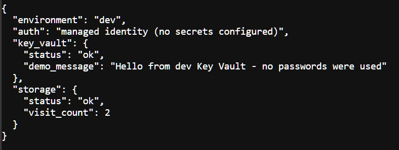
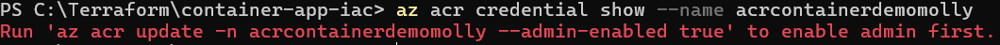
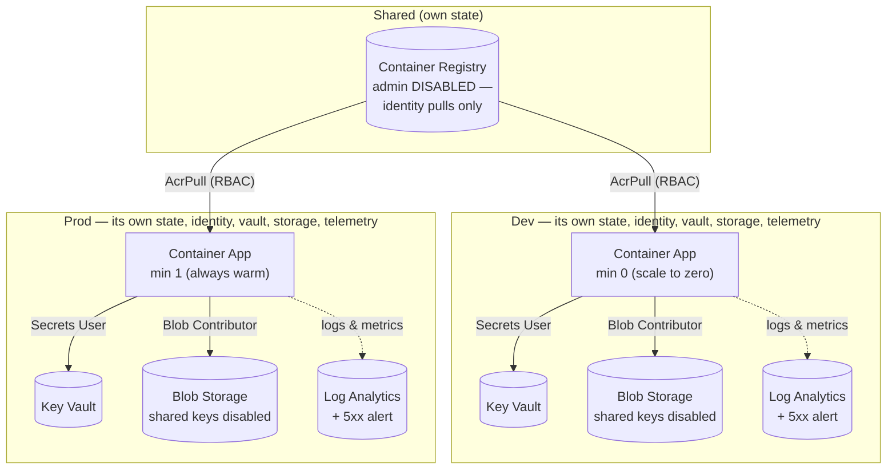
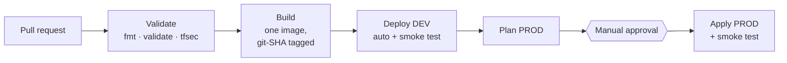
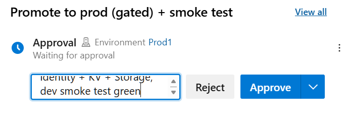
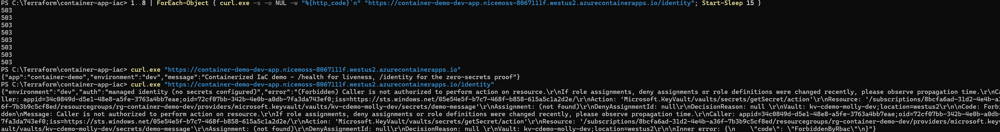
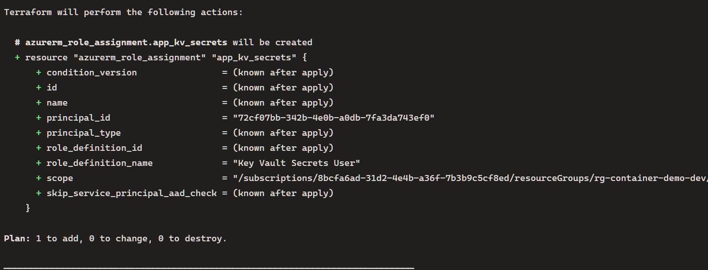
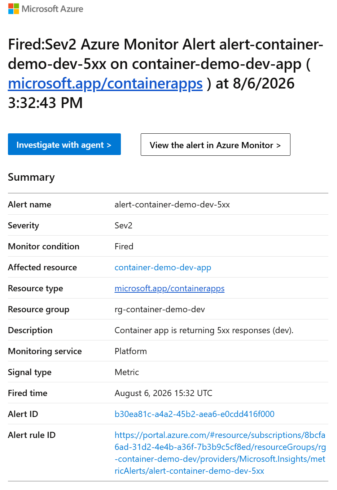

# Containerized App on Azure — Multi-Environment IaC, Zero Secrets

A containerized Python service on Azure Container Apps, promoted through dev and prod environments by a gated pipeline, authenticating to every Azure resource it touches — the container registry, Key Vault, and Blob Storage — as a **managed identity**, and observed through per-environment Log Analytics and Azure Monitor alerts. No passwords, keys, or connection strings exist anywhere in this system: not in code, not in configuration, not in Terraform state for the app's access, and not on the registry (admin credentials are disabled — they don't merely go unused, they don't exist).

A deliberate companion to [azure-webapp-iac](https://github.com/MollyMadel3ine/azure-webapp-iac): where that project's security boundary is the **network** (private endpoints, VNet-scoped DNS, no public data paths), this project's boundary is **identity** (RBAC-only access, short-lived tokens, nothing stealable). Together they cover the two dominant Azure security postures — and the trade-offs between them are documented, not hidden.

**Status: complete.** All five phases shipped and verified.

**Live demo — the zero-secrets proof:** both environments run permanently. `/identity` reads a Key Vault secret and increments a Blob Storage counter, all as the managed identity:



And the negative proof — the registry refusing credential access, while both environments (which pull by identity) keep running:



## Architecture



Each environment owns its complete stack — identity, vault, storage, app, and telemetry — in an isolated state file. The only shared resource is the registry, because the promotion doctrine requires both environments to pull the *same* SHA-tagged artifact.

## How changes ship



One image per commit, tagged with the full git SHA. Dev deploys ungated (fast feedback is dev's purpose); the manual gate guards *promotion*. Prod applies the exact plan file reviewed at the gate. After every apply, the pipeline smoke-tests its own deployment — polling `/health` with retries budgeted for scale-from-zero cold starts, and failing the run unless the app answers healthy, with the deployed SHA, from the correct environment.



## Observability — verified by fire drill

Each environment ships Container Apps logs to its own **Log Analytics workspace**, and an **Azure Monitor alert** watches the `Requests` metric filtered to 5xx responses, wired to an email action group. The alert condition matches the app's own failure contract: `/identity` returns 503 when identity-based access fails — so the alert fires on precisely the failure mode the zero-secrets architecture introduces.

**Verified with a drift fire drill:** the app identity's Key Vault role was deleted by hand — simulating permission drift — and `/identity` degraded to 503 Forbidden ("Caller is not authorized... Assignment: (not found)"), the alert fired, and the restore was Terraform itself: the pipeline's next plan detected the missing role assignment as drift (**1 to add**) and reinstated it. The drill demonstrates the alert *and* IaC drift-correction in a single motion — recovery by reconciliation, not by remembering what was broken.







## The zero-secrets design

**Every access is an identity with a least-privilege role.** The app's user-assigned managed identity holds exactly three rights: `AcrPull` on the registry, `Key Vault Secrets User` on its own environment's vault, `Storage Blob Data Contributor` on its own environment's storage. Nothing else, nowhere else.

**Nothing is stealable.** The identity has no password — Azure mints it short-lived tokens via the metadata service, inside the running container. There is no connection string in an environment variable to exfiltrate, no key in Terraform state, nothing to phish. The classic breach scenario — stolen credential replayed from an attacker's machine — has no credential to power it.

**Credential paths are closed, not just unused.** Registry admin access is disabled; storage shared-key auth is disabled (`shared_access_key_enabled = false`). Verified from the outside: `az acr credential show` errors, key-based storage requests 403 — while both environments run.

**Why a user-assigned identity (not system-assigned):** a system-assigned identity exists only *after* the app is created — but the app must pull its image *with* that identity, *during* creation. Creating the identity first, granting `AcrPull`, then creating the app wearing it breaks the loop.

**The security hardening locked out its own tooling — by design.** With shared keys disabled, the Terraform provider's own post-create storage poll (key-based by default) was refused with a 403 by the account it had just created. The fix — `storage_use_azuread = true` in the provider block, plus a data-plane role for the pipeline identity — brought the tooling into compliance with the architecture rather than weakening the architecture for the tooling.

**The trade-off, owned: the pipeline can now administer RBAC.** Creating role assignments requires more than Contributor, so the pipeline's service principal holds *Role Based Access Control Administrator* — an expansion of the Contributor-only doctrine from project #1, made because identities-and-their-rights are now infrastructure this pipeline manages. The mitigation: the role grants RBAC writes and nothing else (unlike Owner), and every assignment it creates is itself reviewed code in this repo.

**Identity is the boundary — the network deliberately isn't.** tfsec flagged the Key Vault's absent network ACL (critical). A Deny-default ACL would block both legitimate clients — the Container App (dynamic egress IPs) and hosted pipeline agents — and the proper fix, VNet integration plus a private endpoint, is precisely the architecture the companion project demonstrates. The finding is deferred with that reasoning annotated inline; reachable is not accessible when every operation demands an Azure AD token from an authorized identity.

**Known issue, found by the fire drill: executor-dependent identity.** One role assignment grants vault access to `data.azurerm_client_config.current` — *whoever runs terraform*. The pipeline's SP and a local session resolve that to different identities, so a local plan wanted to re-point the grant (and couldn't even read the vault to plan). Discovered when the drill's restore was attempted locally; resolved by letting the pipeline (the config's intended executor) perform the restore. The hardening — pinning the grant to the SP's object ID explicitly — is tracked as a follow-up. A useful lesson in what "current client" means in mixed local/pipeline execution.

## Other design decisions

**Environments are data, not code.** Dev/prod differences (replicas, CPU, the name the app reports) live in committed `dev.tfvars`/`prod.tfvars` — gitignore-excepted deliberately, because these hold environment definitions, not secrets. Adding staging would be a tfvars file and a state key, zero new Terraform.

**Isolated state per environment; blast-radius isolation.** A botched dev apply cannot touch prod — prod isn't in the state being written. The shared registry lives in a third, rarely-touched state, applied manually bootstrap-style.

**Per-environment telemetry, same isolation logic.** Each environment's workspace, action group, and alert live in that environment's state and resource group — dev's noise never pages prod's channel, and a prod-only threshold change is a prod-only apply.

**Log wiring replaces the environment — a known, accepted cost.** Attaching Log Analytics to a Container Apps environment forces replacement of the environment and the app in it (brief prod downtime during that one apply, reviewed knowingly at the gate). A zero-downtime path — parallel environment plus traffic shift — exists and is out of scope; documented rather than hidden.

**SHA tags, never latest.** Every image is tagged with the commit that built it, and the running app reports its tag at `/health` — ask production which commit it is, and it answers.

**Security findings are triaged, not silenced.** tfsec runs at full sensitivity. Phase 4's scan produced five findings: three fixed (TLS floor pinned, secret content-type and expiry added), two deferred with reasoned annotations (network ACL — see above; purge protection, which would lock vault names for 90 days per destroy in an environment that rebuilds routinely). The gate's sensitivity was never lowered.

**Cold-start-literate automation.** Dev scales to zero, so smoke tests retry rather than fail on first wake-up; scripts `set -e` so failures report at their cause. Metric alerts on freshly created resources can race Azure's metric-definition registration (a lesson imported from project #1); RBAC changes — grants and revocations alike — propagate over minutes, which the fire drill's timeline demonstrates in both directions.

**Flat configuration, no modules — unlike project #1.** Per-environment parameterization lives in tfvars; resources group by concern across files (`main.tf`, `monitoring.tf`) rather than modules. Different project, different structure, both reasoned.

**ASCII-only in code comments.** Learned directly: a Unicode em-dash in a comment made two terraform versions disagree about column alignment — local fmt passed, the pipeline's pinned version failed, on identical content. Multi-byte characters and column-math tooling don't mix.

## Repository structure

```
├── app/
│   ├── main.py              # FastAPI: /health (liveness) + /identity (zero-secrets proof)
│   └── requirements.txt     # fastapi, uvicorn, azure-identity, azure-keyvault-secrets, azure-storage-blob
├── Dockerfile               # Multi-stage, non-root, ~150MB
├── azure-pipelines.yml      # The promotion flow
├── main.tf                  # One environment definition (which one = init key + tfvars)
├── monitoring.tf            # Per-environment Log Analytics, action group, 5xx alert
├── variables.tf
├── outputs.tf
├── dev.tfvars / prod.tfvars # Environment definitions, committed on purpose
├── shared/main.tf           # The registry (own state, manual apply, admin disabled)
├── docs/project-plan.md
└── images/
```

## Local development

```bash
# Local container loop — no Azure needed:
docker build -t container-demo:local .
docker run --rm -p 8000:8000 container-demo:local

# Terraform sessions declare their environment at init AND plan — always together:
terraform init -reconfigure -backend-config="key=container-app-dev.tfstate"
terraform plan -var-file=dev.tfvars
# Prod is pipeline territory; local prod sessions are the exception — and
# vault-touching resources plan correctly only as the pipeline identity
# (see the executor-dependent identity note above).
```

## Getting started (from zero)

Prerequisites: Terraform ≥ 1.5, Azure CLI, Docker Desktop, a state storage account, `Microsoft.App` registered, and an Azure DevOps setup (variable group with SP credentials; the SP holding Contributor + RBAC Administrator + AcrPush; a gated `Prod1` environment).

```bash
cd shared && terraform init && terraform apply && cd ..   # the registry, once
# then: merge anything to main — the pipeline builds, deploys dev,
# pauses at the gate, and creates prod on approval.
```

## Cost

Prod's always-warm replica ~$12/month, ACR Basic ~$5, dev scales to zero; Key Vault, storage, and Log Analytics at demo volume are pennies. ~$17/month as a permanently live demo; set prod's `min_replicas = 0` to idle at ~$5.

## Project status

- [x] **Phase 1 — Containerize + core infrastructure**: multi-stage Dockerfile, ACR, Container Apps via Terraform
- [x] **Phase 2 — CI/CD**: SHA-tagged builds, plan-as-artifact, gated apply, self-verifying smoke tests
- [x] **Phase 3 — Multi-environment promotion**: dev and prod from one configuration; merge → dev → gate → prod
- [x] **Phase 4 — Zero secrets**: managed identity for registry, vault, and storage; credential paths disabled and verified dead
- [x] **Phase 5 — Observability**: per-environment Log Analytics and 5xx alerts matched to the app's failure contract — verified by a drift fire drill, restored by Terraform reconciliation

**Follow-up tracked:** pin the pipeline's vault grant to the SP's object ID explicitly (replacing the executor-dependent `current client` reference).

Full plan: [docs/project-plan.md](docs/project-plan.md)
